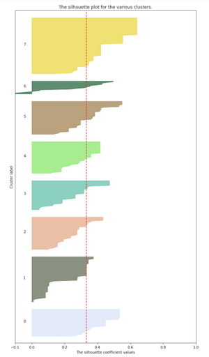
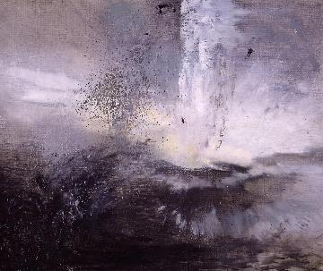
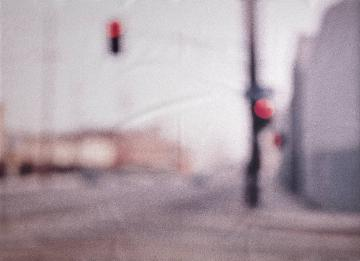
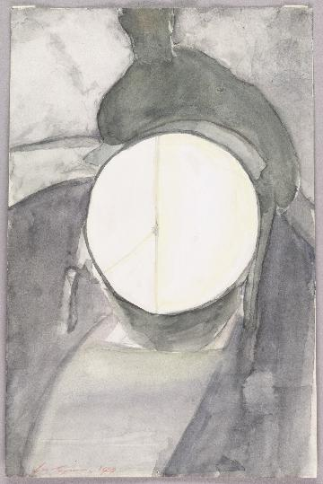

## Iteration 1:

### Process notes
- bertin variables produce very few image cluster results
- tested bertin variables with varying clusters
	- using 4, 8, 12, 16, 20, 24 clusters
	- uneven distribution
	- none of these seem remotely related
	- ERROR line 15
	/opt/anaconda3/lib/python3.7/site-packages/ipykernel_launcher.py:9: ConvergenceWarning: Number of distinct clusters (19) found smaller than n_clusters (100). Possibly due to duplicate points in X.
  if __name__ == '__main__':
  - still got clusters?
  - wow literally none of these are even in any way lol
- could not get string to float "UK", line 27
	- removed country_of_origin
	- get the same error with basically every variable including a string
	- need to vectorizes
- tried using only "date", text is included in occassional year estimates
- binary columns work well
- playing with bertin variables and binary options 
- worked on minimizing variables to clarify clusters

### Methods
In this iteration, I chose to proceed by clustering acccording to value, hue, texture, and spacial dimension. I proceeded with 10 clusters as the plots showed a smaller difference in size of clusters across these than in other breakdown; although 8 clusters was similar in cluster balance, I went with 10 because the smaller clusters seemed like less of an outlier when there were a few more smaller groups.

   
_8 clusters vs. 10 clusters_  

Looking at these variables provided a lot of insight into characteristics like depth and form of the works. I have inluded curator descriptions for each collection, and samples from clusters 0, 1, 2, 7 and 9. I went pretty abstract in describing these clusters, please understand that I was having a great time with it.

## Iteration 1 Cluster Analysis:
**Cluster 0:  The Colorful Boundaries Collection**  
Images in cluster 0 can be identified with their colorful, primarily primary, palettes. The shapes have strong lines and bold forms.  

    

**Cluster 1: The Deep Monotonous Dream Collection**  
Images in cluster 1 are consistent with their ambiguous lines and sharp perspectives. This collection is noted by the varied depth of the images, as well as their limited coloration.  

    

**Cluster 2: The Blurred Movement Collection**  
Images in cluster 2 are defined by their lack of definition. While parts of these images may be clearer than others, this collection is cemented in the frequent presence of non-distint lines and the implication of movement.  

  

**Cluster 3: The Surreal-in-form Collection**  
Images in cluster 3 contain bold, distinct forms that vary in their realism and experiment with light and scattered shapes.

**Cluster 4: The Long Horizon Collection**  
Images in cluster 4 contain all different interpretations of landscapes. These images display combinations of distance and depth paired with limited color palettes ranging from 2-4 colors

**Cluster 5: The Abstract Scratch Collection**  
Images in cluster 5 are primarily defined by their scratchy qualities and messy forms. These images offer many interpretations of what "messy" can be and offten draw from dramatic lighting.

**Cluster 6: The Scattered Fragment Collection**  
Images in cluster 6 are drawn together by the way their high-contrast representations stretch across the whole canvas. They offer strange and often aggressive interpretations of organization and critiques of institutions.

**Cluster 7: The Objectificationo Collection**  
Images in cluster 7 are noted by their representations of singular objects, whether represented in multitudes or single instances. The objects in these images are contained to simple forms and usually include only one or two colors, if any.  

        

**Cluster 8: The Wild Wooden Collecion**  
The images in cluster 8 contain mostly natural palettes, with organic textures and warm lighting. They present contained shapes and often fantastic ideas.

**Cluster 9: The Droopy Grunge Collection**  		
The images in cluster 9 are seen as melancholy in intention, with a wide variety of color usage and grungy textures. These images are often segmented composition, and contain subtle movement.  

    