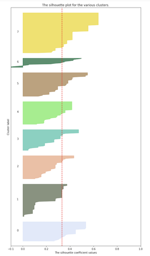

## Iteration 2:

### Process notes
- attempting to incorporate binarization or hashing for medium and movement variables

### Methods
In this iteration, I wanted to explore art_movement and primary_medium in addition to the bertin variables value, color, texture, and the spacial dimension option.

   
_8 clusters vs. 10 clusters_  

Looking at these variables provided a lot of insight into characteristics like depth and form of the works. I have inluded curator descriptions for each collection, and samples from clusters 0, 1, 2, 7 and 9. I went pretty abstract in describing these clusters, please understand that I was having a great time with it.

## Iteration 2 Cluster Analysis:
**Cluster 0:  The Colorful Boundaries Collection**  
Images in cluster 0 can be identified with their colorful, primarily primary, palettes. The shapes have strong lines and bold forms.  

